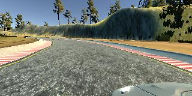
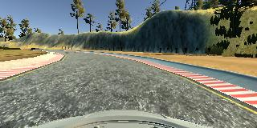
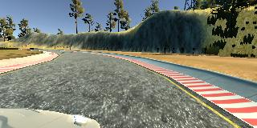
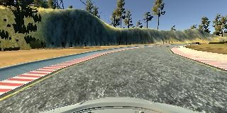

# Self-Driving Car Project 3. Behavioral Cloning

## Project Overview

In this project, I will use deep neural networks and convolutional neural networks to clone driving behavior. I will train, validate and test a model using Keras. The model will output a steering angle to an autonomous vehicle.

We will need to use a car and road simulator from Udacity where we can steer a car around a track for data collection. We will use image data and steering angles to train a neural network and then use this model to drive the car autonomously around the track.

My goals/steps of this project are the following:
* Use the simulator to collect data of good driving behavior
* Build a convolution neural network in Keras that predicts steering angles from images
* Train and validate the model with a training and validation set
* Test that the model successfully drives around track one without leaving the road

### Dependencies
This project requires:

* [CarND Term1 Starter Kit](https://github.com/udacity/CarND-Term1-Starter-Kit)

The project enviroment can be created with this Starter Kit. Click [here](https://github.com/udacity/CarND-Term1-Starter-Kit/blob/master/README.md) for the details.

The following resources can be found in this github repository:
* drive.py
* video.py

The car and road simulator can be downloaded from the Udacity GitHub repository.

### Details on the Scripts/Steps

#### `drive.py`

Usage of `drive.py` requires the trained model as an h5 file, i.e. `model.h5`. See the [Keras documentation](https://keras.io/getting-started/faq/#how-can-i-save-a-keras-model) for how to create this file using the following command:
```sh
model.save(filepath)
```

Once the model has been saved, it can be used with drive.py using this command:

```sh
python drive.py model.h5
```

The above command will load the trained model and use the model to make predictions on individual images in real-time and send the predicted angle back to the server via a websocket connection.

Note: There is known local system's setting issue with replacing "," with "." when using drive.py. When this happens it can make predicted steering values clipped to max/min values. If this occurs, a known fix for this is to add "export LANG=en_US.utf8" to the bashrc file.

##### Saving a Video of the Autonomous Agent

```sh
python drive.py model.h5 run1
```

The fourth argument, `run1`, is the directory in which to save the images seen by the agent. If the directory already exists, it'll be overwritten.

```sh
ls run1

[2017-01-09 16:10:23 EST]  12KiB 2017_01_09_21_10_23_424.jpg
[2017-01-09 16:10:23 EST]  12KiB 2017_01_09_21_10_23_451.jpg
[2017-01-09 16:10:23 EST]  12KiB 2017_01_09_21_10_23_477.jpg
[2017-01-09 16:10:23 EST]  12KiB 2017_01_09_21_10_23_528.jpg
[2017-01-09 16:10:23 EST]  12KiB 2017_01_09_21_10_23_573.jpg
[2017-01-09 16:10:23 EST]  12KiB 2017_01_09_21_10_23_618.jpg
[2017-01-09 16:10:23 EST]  12KiB 2017_01_09_21_10_23_697.jpg
[2017-01-09 16:10:23 EST]  12KiB 2017_01_09_21_10_23_723.jpg
[2017-01-09 16:10:23 EST]  12KiB 2017_01_09_21_10_23_749.jpg
[2017-01-09 16:10:23 EST]  12KiB 2017_01_09_21_10_23_817.jpg
...
```

The image file name is a timestamp of when the image was seen. This information is used by `video.py` to create a chronological video of the agent driving.

#### `video.py`

```sh
python video.py run1
```

Creates a video based on images found in the `run1` directory. The name of the video will be the name of the directory followed by `'.mp4'`, so, in this case the video will be `run1.mp4`.

Optionally, one can specify the FPS (frames per second) of the video:

```sh
python video.py run1 --fps 48
```

Will run the video at 48 FPS. The default FPS is 60.

#### Tips
1. Keep in mind that training images are loaded in BGR colorspace using cv2 while drive.py load images in RGB to predict the steering angles.

2. We could slightly alter the code in `drive.py` and/or `video.py` to create a video of what our model sees after the image is processed (may be helpful for debugging).

## Implementation

Here I will describe how I implement the goals of this project.  

#### Code and Files

My project includes the following files:
* `model.py` containing the script to create and train the model
* `drive.py` for driving the car in autonomous mode
* `model.h5` containing a trained convolution neural network 
* `writeup_report.pdf` summarizing the results

#### 2. Use the Model
Using the Udacity provided simulator and my `drive.py` file, the car can be driven autonomously around the track by executing:
```sh
python3 drive.py model.h5
```

#### 3. Code
The `model.py` file contains the code for training and saving the convolution neural network. The file shows the pipeline I used for training and validating the model, and it contains comments to explain how the code works.

### Model Design and Training Strategy

#### 1. Model Architecture Layers
The model I used as the final model consists of a convolution neural network with 3x3 and 5x5 filter sizes and depths between 24 and 64 (`model.py lines 127-131`). Notice my experimental model consists of a convolution neural network with 3x3 filter sizes and depths between 16 and 32 (`model.py lines 147-149 and lines 180-183`) . 

The model includes ReLU layers to introduce nonlinearity (`model.py line 127-131, line 182 and line 195`), and the data is normalized in the model using a Keras lambda layer (`model.py line 177`). 

#### 2. Reducing Overfitting
The NVIDIA model I used don't have the dropout layers. My experience is that this project is more about the data than tweaking the model, so once the model is stable enough, I turned to collecting more data and then train and test with it. Notice the experimental model contains dropout layers in order to reduce overfitting (`model.py line 149 and line 154`).

The model was trained and validated on different data sets to ensure that the model was not overfitting (`model.py line 75, lines 207, and line 214`). The model was tested by running it through the simulator and ensuring that the vehicle could stay on the track.

#### 3. Model Parameters Tuning
The model used an Adam optimizer, so the learning rate was not tuned manually (`model.py line 120`).

#### 4. Training Data Collection
Training data was chosen to keep the vehicle driving on the road. I used a combination of center lane driving, recovering from the left and right sides of the road.

For details about how I created the training data, see the next section. 

### Model Architecture and Training

#### 1. Solution Design Approach
The overall strategy for building up a model architecture was to use convolution neural network for feature extraction and fully connected layers for regression. ReLU layers are used to introduce nonlinearity. Also, a few other approaches are used to reduce overfitting, e.g. dropouts, batch normalization, and separated training and validation datasets. Note the normalization is also helpful to accelerate the training. Notice the NVIDIA model didn't use dropout.

The final step was to run the simulator to see how well the car was driving around the track. There were a few spots where the vehicle fell off the track. To improve the driving behavior in these cases, I collected more data (collect the images by driving) and increased the epochs from 2 to 4, and trained the model again.

At the end of the process, the vehicle is able to drive autonomously around the track without leaving the road.

#### 2. Model Architecture

##### 1. The Final Model 
Based on some further discussions with the students in the Slack channel after trying my experimental model, I decided to use the  [NVIDIA model](https://images.nvidia.com/content/tegra/automotive/images/2016/solutions/pdf/end-to-end-dl-using-px.pdf) as my final model. (I would be really interested to try the [comma.ai model](https://github.com/commaai/research/blob/master/train_steering_model.py) mentioned by some other discussions later.) The NVIDIA model architecture I used `(model.py lines 122-139`) consisted of a convolution neural network with the following layers:

| Layer Group | Layer | Description (Size, Output) |
| :---------- | :---- | :---------- |
| **Input** | Input | 160x320x3 |
| **Preprocessing** | Cropping | (50, 20), (0,0), Output 90x320x3 |
| **Preprocessing** | Lambda | Output 90x320x3 |
| **Group1 (Convolution)** | Convolution (with ReLU) | 5×5×24, Stride 2x2, Output 43×158×24 |
| **Group1** | Convolution (with ReLU) | 5×5×36, Stride 2x2, Output 20×77×36 |
| **Group1** | Convolution (with ReLU) | 5×5×48, Stride 2x2, Output 8×37×48 |
| **Group1** | Convolution (with ReLU) | 3×3×64, Output 6×35×64 |
| **Group1** | Convolution (with ReLU) | 3×3×64, Output 4×33×64 |
| **Group2 (Fully Connected)** | Flatten | Output 8448 |
| **Group2** | Fully Connected | 100, Output 100 |
| **Group2** | Fully Connected | 50, Output 50 |
| **Group2** | Fully Connected | 10, Output 10 |
| **Group2** | Fully Connected | 1, Output 1 |

##### 2. The Experimental Model 
I tried an experimental mode, but it didn't perform as well as the NVIDIA model. The reason here is that I didn't use the 5x5 kernel, which is much better than the 3x3 kernel on extracting patterns for this particular scenario - driving on the road. The images taken by the cameras along the road has a lot of similarities than I thought. For this kind of similarities, a kernel that is slightly bigger than 3x3 will perform much better on extracting the common features of the images. And plus, I also didn't use as big depths as the NVIDIA model, which is another reason for the poor performance. My experimental model architecture `(model.py lines 142-161`) consisted of a convolution neural network with the following layers:

| Layer Group | Layer | Description (Size, Output) |
| :---------- | :---- | :---------- |
| **Input** | Input | 160x320x3 |
| **Preprocessing** | Cropping and Lambda | (50, 20), (0,0), Output 90x320x3 |
| **Group1 (Convolution)** | Convolution (with ReLU) | 3×3×16, Stride 2x2, Output 44×159×16 |
| **Group1** | Convolution (with ReLU) | 3×3×16, Output 42×157×16 |
| **Group1** | Normalization | Output 42×157×16 |
| **Group1** | ReLU | Output 42×157×16 |
| **Group1** | Max-Pooling | 2x2x2, Output 21×79×16 |
| **Group1** | Dropout | 0.5, Output 21×79×16 |
| **Group2 (Convolution)** | Convolution (with ReLU) | 3×3×32, Output 19×77×32 |
| **Group2** | Convolution (with ReLU) | 3×3×32, Output 17×75×32 |
| **Group2** | Normalization | Output 17×75×32 |
| **Group2** | ReLU | Output 17×75×32 |
| **Group2** | Max-Pooling | 2x2x2, Output 9×38×32 |
| **Group2** | Dropout | 0.5, Output 9×38×32 |
| **Group3 (Convolution)** | Convolution (with ReLU) | 3×3×32, Output 7×36×32 |
| **Group3** | Convolution (with ReLU) | 3×3×32, Output 5×34×32 |
| **Group3** | Normalization | Output 5×34×32 |
| **Group3** | ReLU | Output 5×34×32 |
| **Group3** | Max-Pooling | 2x2x2, Output 3×17×32 |
| **Group3** | Dropout | 0.5, Output 3×17×32 |
| **Group4 (Fully Connected)** | Flatten | Output 1632 |
| **Group4** | Fully Connected (with ReLU) | 1024, Output 1024 |
| **Group4** | Dropout | 0.25, Output 1024 |
| **Group4** | Fully Connected (with ReLU) | 512, Output 512 |
| **Group4** | Dropout | 0.25, Output 512 |
| **Group4** | Fully Connected (with ReLU) | 128, Output 128 |
| **Group4** | Dropout | 0.25, Output 128 |
| **Group4** | Fully Connected | 1, Output 1 |

#### 3. Collect the Data and Train the Model

The cameras can capture three images (taken from left, right, and the center camera) in each frame during the driving. Here are some examples of images:

A image from the left camera:



A image from the center camera:



A image from the right camera:



To augment the data set, I also flipped images thinking that this would help reducing overfitting and making the model more robust. For example, here is an image that has then been flipped:



After the first data collection process, I had 6000+ images. Trained with this data, the NVIDIA model performed well with the speed of MPH = 9, but it doesn't perform well at MPH = 30, there are lots of sharp turns, and after one more lap, it went of track. Notice the experimental model didn't even finish the first lap, it failed at the right turn. I would say at this point, there is a space for improvement here. The number of images is not very big, colleting more images can still be useful for the training.

Then I tried to collect more images, I had 20000+ images at the end. Trained with this data, the NVIDIA model performed well with the speed of MPH = 9, and much better than before at MPH = 30 with less sharp turns. Notice the experimental model still didn't finish the first lap.

In order to improve the performance (e.g. training speed, accuracy, and etc.) of the model and make it more focused, I firstly cropped the image using the built-in cropping layer (`model.py line 176`) from Keras. I tried some different sizes for the cropping, and ended up by cropping the first 50 row pixels and the last 20 row pixels from each image. After cropping the image size, I used zero-centering normalization on the pixels (`model.py line 177`).

I finally randomly shuffled the data set and put 20% of the data into a validation set(`model.py line 81 and line 102`). 

I used the training set to train the model. The validation set helped determine if the model was over or under fitting. I used 4 epochs because when it was 2, the accuracy is still increasing, so using more epochs would be helpful. After 4 epochs, the incensement was getting smaller and smaller, but the time consumption is getting more and more. So choosing 4 epochs is a decision based on a balance between the accuracy and the time and resource consumption. I used an Adam optimizer so that manually training the learning rate wasn't necessary (`model.py line 119`). Finally, the validation and training mean squared error are around 0.06 ~ 0.07.
